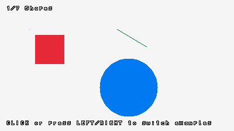
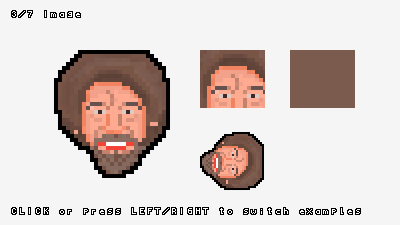
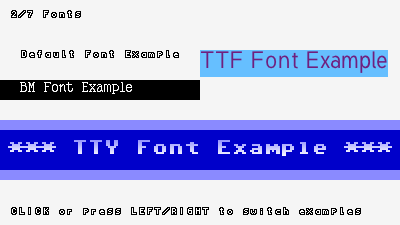
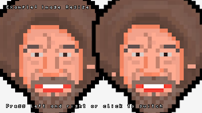
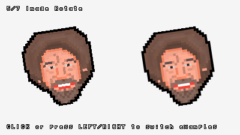
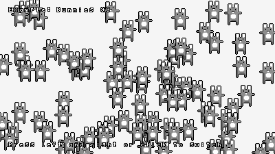

# pntr <a href="https://github.com/robloach/pntr"></a>

Image manipulation library for C99 or C++, with a focus on ease-of-use.

## Usage

``` c
#define PNTR_PIXELFORMAT_RGBA
#define PNTR_IMPLEMENTATION
#include "pntr.h"

int main() {
    pntr_image* image = pntr_new_image(200, 200);
    pntr_draw_circle_fill(image, 100, 100, 80, PNTR_RED);
    pntr_save_image(image, "output.png");
    pntr_unload_image(image);

    return 0;
}
```

## Examples

The [examples](examples) can be run through [SDL](https://www.libsdl.org/), [raylib](https://www.raylib.com/), [libretro](https://www.retroarch.com/), or on the web with [Emscripten](https://emscripten.org/).

[](examples/examples/example_shapes.h)
[](examples/examples/example_image.h)
[](examples/examples/example_fonts.h)
[](examples/examples/example_image_resize.h)
[](examples/examples/example_image_rotate.h)
[](examples/examples/example_bunnymark.h)

## API

This covers how to use *pntr*.

### Configuration

Add these defines prior to including `pntr.h` to modify how it functions.

- `PNTR_IMPLEMENTATION`: Define this in one of your `.c` or `.cpp` files before including `pntr.h`.
- `PNTR_PIXELFORMAT_RGBA`: Use the `RGBA` format
- `PNTR_PIXELFORMAT_ARGB`: Use the `ARGB` pixel format
- `PNTR_ENABLE_DEFAULT_FONT`: Enables the default font
- `PNTR_ENABLE_TTF`: Enables TTF font loading
- `PNTR_ENABLE_FILTER_SMOOTH`: When resizing images, use stb_image, which is slower, but can look better.
- `PNTR_DISABLE_PNG`: Disables loading/saving PNG images
- `PNTR_DISABLE_ALPHABLEND`: Skips alpha blending when rendering images
- `PNTR_DISABLE_MATH`: Disables dependency on C's math.h library
- `PNTR_LOAD_FILE`: Callback to use when asked to load a file. Must match the pntr_load_file() definition.
- `PNTR_SAVE_FILE`: Callback to use when asked to save a file. Must match the pntr_save_file() definition.
- `PNTR_NO_CUTE_PNG_IMPLEMENTATION`: Skips defining `CUTE_PNG_IMPLEMENTATION`. Useful if you're using cute_png elsewhere.
- `PNTR_NO_STB_TRUETYPE_IMPLEMENTATION`: Skips defining `STB_TRUETYPE_IMPLEMENTATION`. Useful if you're using cute_png elsewhere.
- `PTNR_NO_STB_IMAGE_RESIZE_IMPLEMENTATION`: Skips defining `STB_IMAGE_RESIZE_IMPLEMENTATION`. Useful if you're using stb_image_resize elsewhere.

### Functions

``` c
pntr_image* pntr_new_image(int width, int height);
pntr_image* pntr_gen_image_color(int width, int height, pntr_color color);
pntr_image* pntr_image_copy(pntr_image* image);
pntr_image* pntr_image_from_image(pntr_image* image, int x, int y, int width, int height);
void pntr_unload_image(pntr_image* image);
void pntr_clear_background(pntr_image* image, pntr_color color);
void pntr_draw_pixel(pntr_image* dst, int x, int y, pntr_color color);
void pntr_draw_line(pntr_image* dst, int startPosX, int startPosY, int endPosX, int endPosY, pntr_color color);
void pntr_draw_rectangle_fill(pntr_image* dst, int posX, int posY, int width, int height, pntr_color color);
void pntr_draw_rectangle_fill_rec(pntr_image* dst, pntr_rectangle rect, pntr_color color);
void pntr_draw_circle_fill(pntr_image* dst, int centerX, int centerY, int radius, pntr_color color);
void pntr_draw_image(pntr_image* dst, pntr_image* src, int posX, int posY);
void pntr_draw_image_rec(pntr_image* dst, pntr_image* src, pntr_rectangle srcRect, int posX, int posY);
void pntr_draw_image_rotated(pntr_image* dst, pntr_image* src, int posX, int posY, float rotation, float offsetX, float offsetY, pntr_filter filter);
void pntr_draw_image_rec_rotated(pntr_image* dst, pntr_image* src, pntr_rectangle srcRect, int posX, int posY, float rotation, float offsetX, float offsetY, pntr_filter filter);
void pntr_draw_image_flipped(pntr_image* dst, pntr_image* src, int posX, int posY, bool flipHorizontal, bool flipVertical);
void pntr_draw_image_rec_flipped(pntr_image* dst, pntr_image* src, pntr_rectangle srcRec, int posX, int posY, bool flipHorizontal, bool flipVertical);
void pntr_draw_image_rec_scaled(pntr_image* dst, pntr_image* src, pntr_rectangle srcRect, int posX, int posY, float scaleX, float scaleY, float offsetX, float offsetY, pntr_filter filter);
void pntr_draw_image_scaled(pntr_image* dst, pntr_image* src, int posX, int posY, float scaleX, float scaleY, float offsetX, float offsetY, pntr_filter filter);
void pntr_draw_text(pntr_image* dst, pntr_font* font, const char* text, int posX, int posY);
pntr_color pntr_new_color(unsigned char r, unsigned char g, unsigned char b, unsigned char a);
pntr_color pntr_get_color(unsigned int hexValue);
unsigned char pntr_color_get_r(pntr_color color);
unsigned char pntr_color_get_g(pntr_color color);
unsigned char pntr_color_get_b(pntr_color color);
unsigned char pntr_color_get_a(pntr_color color);
void pntr_color_set_r(pntr_color* color, unsigned char r);
void pntr_color_set_g(pntr_color* color, unsigned char g);
void pntr_color_set_b(pntr_color* color, unsigned char b);
void pntr_color_set_a(pntr_color* color, unsigned char a);
pntr_color pntr_image_get_color(pntr_image* image, int x, int y);
pntr_color* pntr_image_get_color_pointer(pntr_image* image, int x, int y);
bool pntr_save_file(const char *fileName, const void *data, unsigned int bytesToWrite);
void* pntr_image_to_pixelformat(pntr_image* image, unsigned int* dataSize, pntr_pixelformat pixelFormat);
bool pntr_save_image(pntr_image* image, const char* fileName);
unsigned char* pntr_save_image_to_memory(pntr_image* image, unsigned int* dataSize);
int pntr_get_pixel_data_size(int width, int height, pntr_pixelformat pixelFormat);
pntr_image* pntr_load_image(const char* fileName);
pntr_image* pntr_load_image_from_memory(const unsigned char* fileData, unsigned int dataSize);
pntr_image* pntr_image_from_pixelformat(const void* data, int width, int height, pntr_pixelformat pixelFormat);
const char* pntr_get_error(void);
void* pntr_set_error(const char* error);
pntr_image* pntr_image_resize(pntr_image* image, int newWidth, int newHeight, pntr_filter filter);
pntr_image* pntr_image_scale(pntr_image* image, float scaleX, float scaleY, pntr_filter filter);
void pntr_image_color_replace(pntr_image* image, pntr_color color, pntr_color replace);
pntr_color pntr_color_tint(pntr_color color, pntr_color tint);
void pntr_image_color_tint(pntr_image* image, pntr_color color);
pntr_color pntr_color_fade(pntr_color color, float alpha);
void pntr_image_color_fade(pntr_image* image, float alpha);
pntr_color pntr_color_brightness(pntr_color color, float factor);
pntr_color pntr_get_pixel_color(void* srcPtr, pntr_pixelformat srcPixelFormat);
void pntr_set_pixel_color(void* dstPtr, pntr_pixelformat dstPixelFormat, pntr_color color);
pntr_font* pntr_load_font_default(void);
void pntr_unload_font(pntr_font* font);
pntr_font* pntr_font_copy(pntr_font* font);
pntr_font* pntr_font_scale(pntr_font* font, float scaleX, float scaleY, pntr_filter filter);
pntr_font* pntr_load_font_bmf(const char* fileName, const char* characters);
pntr_font* pntr_load_font_bmf_from_image(pntr_image* image, const char* characters);
pntr_font* pntr_load_font_bmf_from_memory(const unsigned char* fileData, unsigned int dataSize, const char* characters);
int pntr_measure_text(pntr_font* font, const char* text);
pntr_vector pntr_measure_text_ex(pntr_font* font, const char* text);
pntr_image* pntr_gen_image_text(pntr_font* font, const char* text);
pntr_font* pntr_load_font_tty(const char* fileName, int glyphWidth, int glyphHeight, const char* characters);
pntr_font* pntr_load_font_tty_from_memory(const unsigned char* fileData, unsigned int dataSize, int glyphWidth, int glyphHeight, const char* characters);
pntr_font* pntr_load_font_tty_from_image(pntr_image* image, int glyphWidth, int glyphHeight, const char* characters);
unsigned char* pntr_load_file(const char *fileName, unsigned int *bytesRead);
void pntr_unload_file(unsigned char* fileData);
pntr_font* pntr_load_font_ttf(const char* fileName, int fontSize, pntr_color fontColor);
pntr_font* pntr_load_font_ttf_from_memory(const unsigned char* fileData, unsigned int dataSize, int fontSize, pntr_color fontColor);
pntr_color pntr_color_invert(pntr_color color);
void pntr_image_color_invert(pntr_image* image);
pntr_color pntr_color_alpha_blend(pntr_color dst, pntr_color src);
pntr_rectangle pntr_image_alpha_border(pntr_image* image, float threshold);
void pntr_image_crop(pntr_image* image, int x, int y, int width, int height);
void pntr_image_alpha_crop(pntr_image* image, float threshold);
void pntr_image_color_brightness(pntr_image* image, float factor);
void pntr_image_flip_vertical(pntr_image* image);
void pntr_image_flip_horizontal(pntr_image* image);
pntr_color pntr_color_contrast(pntr_color color, float contrast);
void pntr_image_color_contrast(pntr_image* image, float contrast);
void pntr_image_alpha_mask(pntr_image* image, pntr_image* alphaMask, int posX, int posY);
void pntr_image_resize_canvas(pntr_image* image, int newWidth, int newHeight, int offsetX, int offsetY, pntr_color fill);
pntr_image* pntr_image_rotate(pntr_image* image, float rotation, pntr_filter filter);
pntr_image* pntr_gen_image_gradient_vertical(int width, int height, pntr_color top, pntr_color bottom);
pntr_image* pntr_gen_image_gradient_horizontal(int width, int height, pntr_color left, pntr_color right);
pntr_image* pntr_gen_image_gradient(int width, int height, pntr_color topLeft, pntr_color topRight, pntr_color bottomLeft, pntr_color bottomRight);
pntr_color pntr_color_bilinear_interpolate(pntr_color color00, pntr_color color01, pntr_color color10, pntr_color color11, float coordinateX, float coordinateY);
```

## Development

To build the tests and examples, use [CMake](https://cmake.org):

``` bash
# Set up the build files.
cmake -B build

# Build the tests and examples.
cmake --build build

# Run the tests
ctest --test-dir build -V
```

### Web Assembly

To build the web-based examples, use [Emscripten](https://emscripten.org/):

``` bash
# Emscripten
emcc examples/pntr_examples_web.c -o build/index.html --preload-file examples/resources@/resources --shell-file examples/pntr_examples_web.html

# Emscripten with SDL
emcc examples/pntr_examples_sdl.c -sUSE_SDL=2 -o build/index.html --preload-file examples/resources@/resources --shell-file examples/pntr_examples_web.html

# Run tests through Node.js
npm it
```

## Acknowledgements

- [cute_png.h](https://github.com/RandyGaul/cute_headers/blob/master/cute_png.h) by [Randy Gaul](https://github.com/RandyGaul) provides the PNG loading/saving
- [SDL_tty](https://github.com/Grumbel/SDL_tty) by [Ingo Ruhnke](https://github.com/Grumbel) provides the [8x8 default font](https://github.com/Grumbel/SDL_tty/blob/master/src/font8x8.h)
- [stb_image_resize.h](https://github.com/nothings/stb/blob/master/stb_image_resize.h) by [Sean Barrett](https://github.com/nothings) provides the smooth image resizing
- [stb_truetype.h](https://github.com/nothings/stb/blob/master/stb_truetype.h) by [Sean Barrett](https://github.com/nothings) provides TrueType font support
- [tester](https://github.com/zpl-c/tester) from [zpl](https://github.com/zpl-c) provides the unit testing framework
- [raylib](https://github.com/raysan5/raylib) inspired some of the design patterns
- [Logo](https://www.pixilart.com/art/bob-ross-9910c4da4b3a1c8) by [Ravenist](https://www.pixilart.com/ravenist), used with [permission](https://www.reddit.com/r/PixelArt/comments/fi2b1v/oc_felt_a_little_sad_so_i_watched_bob_ross_videos/j6ordqn/)

## License

Unless stated otherwise, all works are:

- Copyright (c) 2023 [Rob Loach](https://robloach.net)

... and licensed under:

- [zlib License](LICENSE)
