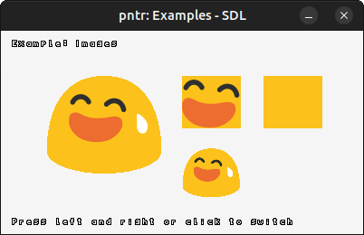
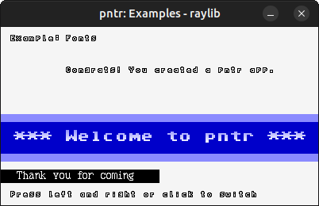

# pntr

Low-level image manipulation using the RGBA or ARGB pixel data in C99.

``` c
#define PNTR_PIXELFORMAT_RGBA
#define PNTR_IMPLEMENTATION
#include "pntr.h"
```

## Screenshots





``` bash
# setup for native build
cmake -B build

# build library and native demos
cmake --build build
```

## Web Assembly

``` bash
# Emscripten
emcc examples/pntr_examples_web.c -o build/index.html --preload-file examples/resources@/resources --shell-file examples/pntr_examples_web.html

# Emscripten with SDL
emcc examples/pntr_examples_sdl.c -sUSE_SDL=2 -o build/index.html --preload-file examples/resources@/resources --shell-file examples/pntr_examples_web.html
```

## License

[Zlib](LICENSE)
